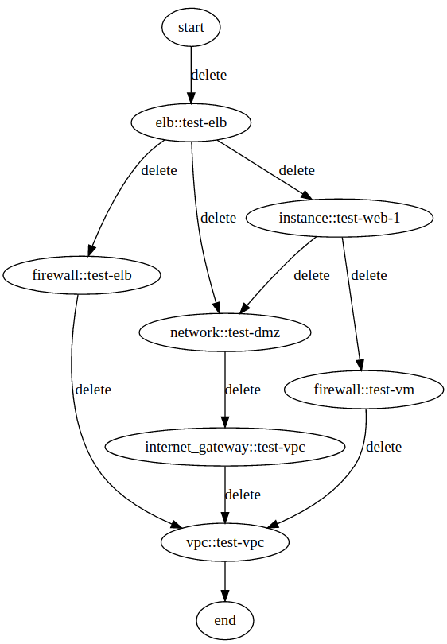

## Scheduler

master:  [](https://circleci.com/gh/ernestio/scheduler/tree/master)  
develop: [](https://circleci.com/gh/ernestio/scheduler/tree/develop)

Scheduler is a service to process actions associated with a given environment and it's components. It runs on top of nats.io.

Scheduler provides several key features:

- Dependency graph scheduling. Each component is scheduled based on its relation to other components and allows independant components to be provisioned in parallel.
- Templating: You can use the templating system to fill some component details with other component properties.
- External persistence: Scheduler will call an external service to persist the current state of the service build and its components.

### Quick start

```sh
#Install with git
git clone git@github.com:ernestio/scheduler.git

make deps && make install

scheduler
```

### Running tests

```sh
make dev-deps && make test
```

### Operation

The scheduler will send a `components.verb.provider` for component. The order is defined by the dependencies specified on `edges` and will wait for `component.verb.provider.status`, where status can be `done` or `error`.

When a completed component event is received, the latest service mapping is retrieved from service store. The state of the component is then updated in both `changes` and `components`. The graph is then inspected for all dependants of the completed component. These dependant components are then scheduled when all of its dependencies are satisfied.

If an errored component is received, scheduler will wait for all other in flight components to complete before sending an error back to the user. No other components will be sent in this errored state.

The graph library utilised by the scheduler can be found at [graph library](https://github.com/r3labs/graph).

### External Dependencies

As scheduler does not provide any persistence system; it directly depends on [service-store](https://github.com/ernestio/service-store), and its communication is accomplished through nats.io.

### Input Mapping

The input mapping defines the steps a scheduler must take to complete a build. The required fields for each component are:

- `id`: The id of the service being provisioned.
- `action`: The action of the service
- `edges`: The edges define the directed connection between components, as defined by a `source` and a `destination`.
- `components`: This collection of components represents the _current_ state of the service.
- `changes`: This collection of components represents the _desired_ state of the service.

This output is generated by defintion-mapper with execution ordering and dependencies configured before being sent to scheduler.

The output of this can be vizualised using graphviz as follows:



An example of the input json to scheduler:

```json
{
    "id": "test-generated-id",
    "action": "service.delete",
    "edges": [
        {
            "destination": "vpc::test-vpc",
            "length": 1,
            "source": "internet_gateway::test-vpc"
        },
        {
            "destination": "vpc::test-vpc",
            "length": 1,
            "source": "firewall::test-vm"
        },
        {
            "destination": "internet_gateway::test-vpc",
            "length": 1,
            "source": "network::test-dmz"
        },
        {
            "destination": "vpc::test-vpc",
            "length": 1,
            "source": "firewall::test-elb"
        },
        {
            "destination": "firewall::test-vm",
            "length": 1,
            "source": "instance::test-web-1"
        },
        {
            "destination": "network::test-dmz",
            "length": 1,
            "source": "instance::test-web-1"
        },
        {
            "destination": "firewall::test-elb",
            "length": 1,
            "source": "elb::test-elb"
        },
        {
            "destination": "network::test-dmz",
            "length": 1,
            "source": "elb::test-elb"
        },
        {
            "destination": "instance::test-web-1",
            "length": 1,
            "source": "elb::test-elb"
        },
        {
            "destination": "end",
            "length": 1,
            "source": "vpc::test-vpc"
        },
        {
            "destination": "elb::test-elb",
            "length": 1,
            "source": "start"
        }
    ],
    "components": [
        {
            "_action": "delete",
            "_component": "vpc",
            "_component_id": "vpc::test-vpc",
            "_provider": "aws",
            "_state": "waiting",
            "auto_remove": true,
            "name": "test-vpc",
            "service": "test-generated-id",
            "subnet": "10.0.0.0/16",
            "tags": {
                "Name": "test-vpc",
                "ernest.service": "test"
            },
            "vpc_aws_id": "vpc-00000000"
        },
        {
            "_action": "delete",
            "_component": "internet_gateway",
            "_component_id": "internet_gateway::test-vpc",
            "_provider": "aws",
            "_state": "waiting",
            "internet_gateway_aws_id": "igw-00000000",
            "name": "test-vpc",
            "service": "test-generated-id",
            "tags": {
                "Name": "test-vpc",
                "ernest.service": "test"
            },
            "vpc": "test-vpc",
            "vpc_id": "vpc-00000000"
        },
        {
            "_action": "none",
            "_component": "credentials",
            "_component_id": "credentials::aws",
            "_provider": "aws",
            "_state": "waiting",
            "name": "test-aws",
            "region": "eu-west-1"
        }
    ],
    "changes": [
        {
            "_action": "delete",
            "_component": "vpc",
            "_component_id": "vpc::test-vpc",
            "_provider": "aws",
            "_state": "waiting",
            "auto_remove": true,
            "name": "test-vpc",
            "service": "test-generated-id",
            "subnet": "10.0.0.0/16",
            "tags": {
                "Name": "test-vpc",
                "ernest.service": "test"
            },
            "vpc_aws_id": "vpc-00000000"
        },
        {
            "_action": "delete",
            "_component": "internet_gateway",
            "_component_id": "internet_gateway::test-vpc",
            "_provider": "aws",
            "_state": "running",
            "internet_gateway_aws_id": "igw-00000000",
            "name": "test-vpc",
            "service": "test-generated-id",
            "tags": {
                "Name": "test-vpc",
                "ernest.service": "test"
            },
            "vpc": "test-vpc",
            "vpc_id": "vpc-00000000"
        },
        {
            "_action": "delete",
            "_component": "firewall",
            "_component_id": "firewall::test-vm",
            "_provider": "aws",
            "_state": "completed",
            "name": "test-vm",
            "network_aws_id": null,
            "rules": {
                "egress": [
                    {
                        "from_port": 0,
                        "ip": "0.0.0.0/0",
                        "protocol": "-1",
                        "to_port": 65535
                    }
                ],
                "ingress": [
                    {
                        "from_port": 0,
                        "ip": "10.0.0.0/16",
                        "protocol": "tcp",
                        "to_port": 65535
                    }
                ]
            },
            "security_group_aws_id": "sg-00000000",
            "service": "test-generated-id",
            "tags": {
                "Name": "test-vm",
                "ernest.service": "test"
            },
            "vpc": "test-vpc",
            "vpc_id": "vpc-00000000"
        },
        {
            "_action": "delete",
            "_component": "network",
            "_component_id": "network::test-dmz",
            "_provider": "aws",
            "_state": "completed",
            "availability_zone": "eu-west-1a",        
            "internet_gateway": "test-vpc",
            "internet_gateway_aws_id": "igw-00000000",
            "is_public": true,
            "name": "test-dmz",
            "network_aws_id": "subnet-00000000",
            "range": "10.0.11.0/24",
            "service": "test-generated-id",
            "tags": {
                "Name": "test-dmz",
                "ernest.service": "test"
            },
            "vpc": "test-vpc",
            "vpc_id": "vpc-00000000"
        },
        {
            "_action": "delete",
            "_component": "firewall",
            "_component_id": "firewall::test-elb",
            "_provider": "aws",
            "_state": "completed",
            "name": "test-elb",
            "network_aws_id": null,
            "rules": {
                "egress": [
                    {
                        "from_port": 0,
                        "ip": "0.0.0.0/0",
                        "protocol": "-1",
                        "to_port": 65535
                    }
                ],
                "ingress": [
                    {
                        "from_port": 0,
                        "ip": "10.0.0.0/16",
                        "protocol": "tcp",
                        "to_port": 65535
                    },
                    {
                        "from_port": 80,
                        "ip": "0.0.0.0/0",
                        "protocol": "tcp",
                        "to_port": 80
                    }
                ]
            },
            "security_group_aws_id": "sg-00000000",
            "service": "test-generated-id",
            "tags": {
                "Name": "test-elb",
                "ernest.service": "test"
            },
            "vpc": "test-vpc",
            "vpc_id": "vpc-00000000"
        },
        {
            "_action": "delete",
            "_component": "instance",
            "_component_id": "instance::test-web-1",
            "_provider": "aws",
            "_state": "completed",
            "assign_elastic_ip": false,    
            "elastic_ip": "",
            "image": "ami-ed82e39e",
            "instance_aws_id": "i-00000000000000000",
            "instance_type": "t2.micro",
            "ip": "10.0.11.11",
            "key_pair": "test",
            "name": "test-web-1",
            "network_aws_id": "subnet-00000000",
            "network_is_public": false,
            "network_name": "test-dmz",
            "public_ip": "52.48.98.107",
            "security_group_aws_ids": [
                "sg-00000000"
            ],
            "security_groups": [
                "test-vm"
            ],
            "service": "test-generated-id",
            "tags": {
                "Name": "test-web-1",
                "ernest.instance_group": "test-web",
                "ernest.service": "test"
            },
            "user_data": "",
            "volumes": null
        },
        {
            "_action": "delete",
            "_component": "elb",
            "_component_id": "elb::test-elb",
            "_provider": "aws",
            "_state": "completed",
            "dns_name": "test-elb-1103626973.eu-west-1.elb.amazonaws.com",
            "instance_aws_ids": [
                "i-00000000000000000"
            ],
            "instance_names": [
                "test-web-1"
            ],
            "instances": [
                "test-web"
            ],
            "is_private": false,
            "listeners": [
                {
                    "from_port": 80,
                    "protocol": "HTTP",
                    "ssl_cert": "",
                    "to_port": 80
                }
            ],
            "name": "test-elb",
            "network_aws_ids": [
                "subnet-00000000"
            ],
            "networks": [
                "test-dmz"
            ],
            "security_group_aws_ids": [
                "sg-00000000"
            ],
            "security_groups": [
                "test-elb"
            ],
            "service": "test-generated-id",
            "tags": {
                "ernest.service": "test"
            }
        }
    ]
}
```
